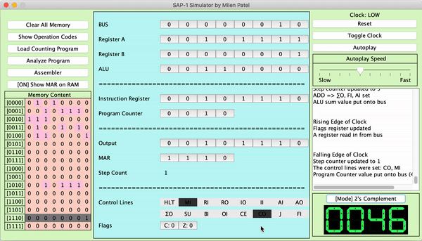

# SAP-1
A simulator For Albert Paul Malvino's SAP-1 Computer made in Java Swing.

After building this computer on a breadboard following Ben Eater's tutorials ([my build running](https://github.com/milen-patel/BreadboardCPU)), I decided to build this simulator. Visually appealing? No. Functional? Yes.

## Features
-**Clock Toggle**: Almost all of the components in SAP-1 are linked together via a system clock. This simulator has a button that can toggle the clock from low to high, or vice versa (as a result, each full clock cycle requires two presses of this button for a rising edge and falling edge).  
-**Event Log**: I built this tool so that potential users could load programs and trace their execution down to the edges of the clock. The event log provides brief descriptions of everything that happens in the computer to aid in learning.  
-**Autoplay**: Having the clock toggle button can be useful for tracing through individual instructions; however, it becomes repetitive to click the button to run an entire program. Thus, an autoplay toggle button has been provided that auto-toggles the clock at 100ms intervals. Click the button once to start auto-playing programs and click it again to stop and return to manual clock mode.  
-**Reset**: Clears the A register, B register, Out register, Program Counter, Instruction Register,	Memory Address Register, Flags Register, and sets the step-cycle counter to 0.  
-**Clear All Memory**: By default, the memory is loaded with random values (as is the case with Ben Eater's physical build). The user has the option to reset all memory values (to 0) in one click using this button.  
-**RAM Bit Changes**: The memory content visualizer on the left of the simulator shows each bit of the computer's memory. Users can click on each bit to toggle between a 1 or 0 in the selected position.  
-**Show Operation Codes**: Displays the operation codes in the Event Log, useful when writing programs.  
-**Load Counting Program**: Loads a counting program in memory that infinitely increments the A register.  
-**Analyze Program**: Translates the current memory content into a more readable form in the SAP Instruction Set, displays the readable version in the Event Log.  

## Getting Start
## Exampple Programs

### Operation Codes
| OPCode      |  Binary Value |
| ----------- | -----------   |
| NOP      	  | 0000          |
| LDA      	  | 0001          |
| ADD      	  | 0010          |
| SUB      	  | 0011          |
| STA      	  | 0100          |
| LDI      	  | 0101          |
| JMP      	  | 0110          |
| JC      	  | 0111          |
| JZ      	  | 1000          |
| OUT      	  | 1110          |
| HLT      	  | 1111          |

